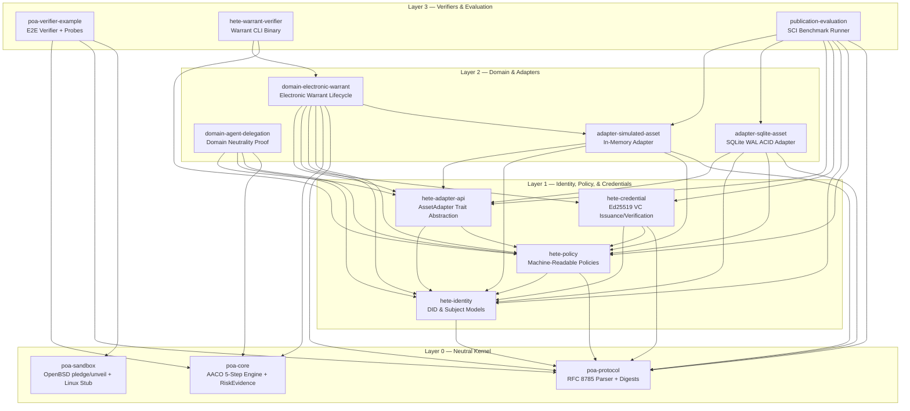

# Electronic Warrant (RegTech Judicial Enforcement Engine)

**Decentralized Identifier-Based Automated Judicial Enforcement: Real-Time and Granular Electronic Warrants Against Financial Fraud**

---

## 1. Executive Summary

This repository houses the standalone, decoupled reference implementation of the **HETE Electronic Warrant System (RegTech Engine)**. 

Historically co-located with voting and intermediate representation prototypes, the electronic warrant engine has been fully refactored into this independent repository. It establishes a platform-neutral, process-oriented authorization (POA) framework for executing real-time judicial freezes, forfeitures, and asset reconciliations against financial fraud across decentralized networks.

### Key Capabilities
- **Platform-Neutral AACO Kernel**: 5-step state transition pipeline (`authorize` $\rightarrow$ `validate` $\rightarrow$ `mutate_candidate` $\rightarrow$ `reconcile` $\rightarrow$ `commit`).
- **RiskEvidence & Adaptive Quarantine**: Integer basis-point arithmetic evaluation of risk evidence with automatic quarantine before asset prepare/commit.
- **Multi-Agency Cryptographic Authorization**: Court, Prosecutor, and Police Ed25519 Verifiable Credential verification.
- **Privacy-Preserving On-Chain Registries**: GDPR-compliant SHA-256 target identifier masking (`SHA-256(DID || WarrantID || Salt)`).
- **Anti-Front-Running Pre-Commitment**: Two-phase public commitment locks preventing asset siphoning during regulatory review.
- **Formal Verification**: Safety (`SAFE-001`~`SAFE-009`) and liveness (`LIVE-001`~`LIVE-003`) properties mathematically proven via TLA+ and model-checked by TLC.
- **Comprehensive Benchmarks**: Empirically measured over 30 runs across B0~B6 benchmarks, 1.32M attack campaign trials, and sub-millisecond in-memory vs. ACID SQLite adapters.

---

## 2. Repository Layout

```text
electronic_warrent/
├── Cargo.toml                       # Rust Workspace root (14 electronic warrant crates)
├── Cargo.lock                       # Deterministic dependency lockfile
├── README.md                        # Master project documentation
├── LICENSE                          # MIT License
│
├── crates/                          # Core Rust Workspace Crates (14 Crates)
│   ├── poa-core/                    # AACO 5-step transition kernel + RiskEvidence engine
│   ├── poa-protocol/                # RFC 8785 canonical JSON, policy inheritance, digests
│   ├── poa-sandbox/                 # OS process isolation (OpenBSD pledge/unveil, Linux stub)
│   ├── hete-identity/               # DID (Decentralized Identifier) & Subject models
│   ├── hete-policy/                 # Machine-readable warrant, authority, & machine policies
│   ├── hete-credential/             # Ed25519 Verifiable Credential issuance & verification
│   ├── hete-adapter-api/            # Asset adapter Trait definitions (prepare/commit hooks)
│   ├── domain-electronic-warrant/   # Electronic warrant lifecycle AACO implementation
│   ├── domain-agent-delegation/     # Domain-neutrality proof domain (SCI paper CLM-011)
│   ├── adapter-simulated-asset/     # In-memory simulated asset storage adapter
│   ├── adapter-sqlite-asset/        # SQLite WAL ACID transaction asset storage adapter
│   ├── poa-verifier-example/        # E2E system verifier and OpenBSD startup probes
│   ├── hete-warrant-verifier/       # Electronic warrant standalone CLI verifier binary
│   └── publication-evaluation/      # SCI publication benchmark runner (B0~B6, 30 runs)
│
├── protocol/                        # Machine-Readable Protocol Specifications
│   ├── base/                        # Base protocol definitions
│   ├── examples/                    # Sample valid configurations
│   ├── fixtures/                    # Inheritance & boundary test fixtures
│   ├── schema/                      # Root protocol JSON schema (poa-protocol-v1.schema.json)
│   └── schemas/                     # Warrant, Authority, Machine, and Manifest schemas
│
├── spec/                            # Formal Specification & Threat Model Documents
│   ├── electronic-warrant-formal-properties.md
│   ├── electronic-warrant-profile.md
│   ├── electronic-warrant-spcs.md
│   ├── electronic-warrant-threat-model.md
│   ├── hete-adapter-contract.md
│   ├── hete-credential-profile.md
│   ├── hete-machine-policy-object.md
│   └── poa-risk-evidence.md
│
├── formal/                          # TLA+ Formal Verification Suite
│   ├── tla/                         # ElectronicWarrant.tla & TLC model configurations
│   ├── results/                     # Safety & Liveness TLC verification evidence
│   └── traces/                      # Executed state traces and conformance logs
│
├── evaluation/                      # Python Benchmark & Security Evaluation Framework
│   ├── check_architecture.py        # ARCH-001 ~ ARCH-025 static boundary verification
│   ├── check_evidence_consistency_v4.py # SCI paper evidence consistency checker
│   ├── run_full_benchmark.py        # 30-run full benchmark runner
│   ├── run_attack_campaign.py       # 1.32M adversarial attack probe
│   ├── run_concurrency_failure_campaign.py
│   ├── run_privacy_linkability_campaign.py
│   ├── run_warrant_evaluation.py
│   └── analysis/, baselines/, comparative/, experiments/, fixtures/, results/
│
├── artifacts/                       # Frozen Publication Snapshot (paper-v1)
│   └── paper-v1/                    # Source code, manifests, and SHA256 checksums
│
├── security/                        # OS Security Templates
│   └── open_bsd_connection.json.example
│
├── cosmwasm_contracts/              # On-Chain CosmWasm Smart Contracts (from hete & burde)
│   ├── hete_warrant_handler/        # CosmWasm warrant settlement orchestrator
│   ├── hete_judicial_verifier/      # CosmWasm multi-agency judicial key & signature verifier
│   ├── local_currency_dex_adapter/  # CosmWasm account freeze & pre-commitment lock adapter
│   └── voting_common_warrant_types/ # Warrant protocol types (WarrantIssuedVP, etc.)
│
├── client_apps/                     # Client Applications, Testnets, & Simulation Agents
│   ├── ngo_fund_demo/               # Compose Desktop RegTech E-Warrant Emergency Freeze client
│   ├── yongin_pay_frontend/         # Kotlin Multiplatform Mobile Client with Execute Warrant view
│   ├── testnet_docker/              # Warrant docker testnet, api_gateway, crypto_helper
│   ├── windows_broker_proxy.py      # Wi-Fi broker proxy for mobile client apps
│   └── simulation_did_agents.py     # Multi-agent DID warrant simulation
│
└── docs/                            # Documentation, Architecture & Work Reports
    ├── architecture/                # System architecture documentation
    │   ├── HETE_WARRANT_ARCHITECTURE.md
    │   ├── architecture.2026.07.22.md
    │   ├── architecture.2026.08.24.md
    │   ├── 04_electronic_warrant_architecture.md
    │   └── README.md
    ├── work_reports/                # Electronic warrant engineering work reports (100~109)
    └── legacy_hete_reports/         # Historical reports from legacy hete (110, 121, 122, 201)
```

---

## 3. Core Architecture & Dependency Graph



---

## 4. Development Environment & Build Instructions

In accordance with the shared workspace environment (`dev_env.md`):
- **Operating System**: Ubuntu 24.04.4 LTS on WSL2 (`wsl.exe -d Ubuntu`).
- **Rust Toolchain**: `rustc 1.96.0` (`/home/sam/.cargo/bin`).
- **Python Virtual Environment**: Python 3.12.13 at `/mnt/d/_Work/goat_bank/.venv`.

### 4.1 Compiling the Workspace
```bash
wsl.exe -d Ubuntu --cd /mnt/d/_Work/goat_bank/electronic_warrent \
  env PATH=/home/sam/.cargo/bin:/mnt/d/_Work/goat_bank/.venv/bin:$PATH \
  cargo check --workspace
```

### 4.2 Running All Unit & Integration Tests
```bash
wsl.exe -d Ubuntu --cd /mnt/d/_Work/goat_bank/electronic_warrent \
  env PATH=/home/sam/.cargo/bin:/mnt/d/_Work/goat_bank/.venv/bin:$PATH \
  cargo test --workspace
```

### 4.3 Verifying Architectural Invariants (ARCH-001 ~ ARCH-025)
```bash
wsl.exe -d Ubuntu --cd /mnt/d/_Work/goat_bank/electronic_warrent \
  env PATH=/home/sam/.cargo/bin:/mnt/d/_Work/goat_bank/.venv/bin:$PATH \
  /mnt/d/_Work/goat_bank/.venv/bin/python evaluation/check_architecture.py
```

### 4.4 Running the Publication Evidence Consistency Gate
```bash
wsl.exe -d Ubuntu --cd /mnt/d/_Work/goat_bank/electronic_warrent \
  env PATH=/home/sam/.cargo/bin:/mnt/d/_Work/goat_bank/.venv/bin:$PATH \
  /mnt/d/_Work/goat_bank/.venv/bin/python evaluation/check_evidence_consistency_v4.py
```

---

## 5. Formal Verification & Invariant Proofs

The electronic warrant state transition logic has been formally modeled in TLA+ (`formal/tla/ElectronicWarrant.tla`):
- **Safety**:
  - `SAFE-001`: Conservation of Total Reserved Balance across all accounts.
  - `SAFE-002`: Terminal states (`FullyExecuted`, `Revoked`, `Expired`, `Released`, `Rejected`) cannot undergo subsequent state transitions.
  - `SAFE-003`: Execution amounts never exceed authorized maximum caps.
  - `SAFE-004`: Nonce freshness and anti-replay protection.
  - `SAFE-005`~`SAFE-009`: Multi-agency signature authorization validity before prepare.
- **Liveness**:
  - `LIVE-001`: Authorized warrants eventually reach terminal disposition.
  - `LIVE-002`: Expired warrants release locked allocations.
  - `LIVE-003`: Quarantined state either resolves or safely revokes without asset leakage.

---

## 6. Client Applications & CosmWasm Adapters

1. **`cosmwasm_contracts/`**:
   - `hete_warrant_handler`: Cross-contract settlement orchestrator handling judicial verification replies and ledger dispatch.
   - `hete_judicial_verifier`: On-chain multi-agency judicial PKI registry and Ed25519 signature validator.
   - `local_currency_dex_adapter`: CosmWasm bank/DEX adapter executing pre-commitment locks, anonymous DID lookups, and account balance freezes.
2. **`client_apps/`**:
   - `ngo_fund_demo`: Desktop Compose interactive client demonstrating emergency asset freezes upon receipt of judicial electronic warrants.
   - `yongin_pay_frontend`: Mobile KMP client implementing the "Execute Warrant" administrative action.
   - `testnet_docker`: Local CosmWasm testnet container environment with `api_gateway.py`, `crypto_helper.py`, and `run_scientific_evaluation.sh`.
