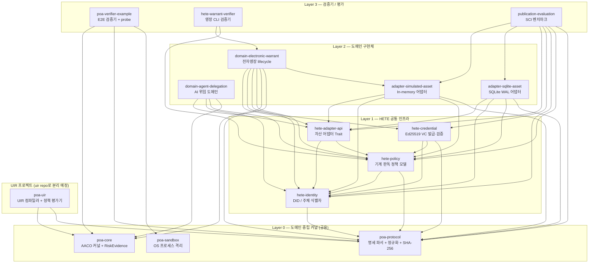

# hete_sandbox Architecture & Source Structure Report (Updated)

**버전**: 2026-08-24 Update  
**이전 버전**: [architecture.2026.07.22.md](./architecture.2026.07.22.md)  
**Repository**: `hete_sandbox`  
**상태**: 복수의 독립 연구 프로젝트가 단일 workspace에 공존하는 현재 상태를 기록하고, 향후 분리 계획의 기준 문서로 활용한다.

---

## 1. 현재 상태 개요 — "이질적 프로젝트 공존 구조"

`hete_sandbox`는 원래 **POA (Process-Oriented Authorization) / HETE 전자영장** 프로토타입 개발·SCI 논문 검증용 단일 샌드박스로 출발하였으나, 이후 두 개의 독립 연구 주제가 추가되어 현재 세 개의 서로 다른 성격의 프로젝트가 하나의 Rust workspace 내에 공존하고 있다.

| 프로젝트 | 성격 | 현재 위치 | 향후 이관 대상 |
|---|---|---|---|
| **POA / HETE 전자영장** | Process Trust Architecture + 전자영장 도메인 구현 + SCI 검증 | `crates/poa-*`, `crates/hete-*`, `crates/domain-*`, `crates/adapter-*` | `hete_sandbox` (현행 유지) |
| **UIR (Universal Intermediate Representation)** | 다국어 AI Research Input 정책 제어 언어 인프라 | `crates/poa-uir/`, `evaluation/uir*/`, `results/uir*/`, `protocol/schemas/uir.schema.json`, `spec/poa-uir.md` | **`uir` repository** |
| **PBEA (Policy-Based Evaluation Architecture)** | 정책 기반 평가 전환 요청 프레임워크 | `protocol/schemas/pbea-eval-transition-request.json` | **`pbea` repository** |

---

## 2. 전체 Directory 구조

```text
hete_sandbox/
├── Cargo.toml                       # Rust Workspace root (15 crates)
├── Cargo.lock
│
├── crates/                          # 모든 Rust 구현 crate (15개)
│   │
│   │  ── [Layer 0: 도메인 중립 커널 — POA 공용] ──
│   ├── poa-core/                    # AACO 5단계 상태전이 커널 + RiskEvidence 엔진
│   ├── poa-protocol/                # JSON 프로토콜 명세 파서, 상속, RFC8785 정규화, SHA-256
│   ├── poa-sandbox/                 # OS 프로세스 격리 (OpenBSD pledge/unveil, Linux stub)
│   │
│   │  ── [Layer 1: HETE 정체성/정책/자격증명 — HETE 전자영장 공용] ──
│   ├── hete-identity/               # DID/주체 식별자 모델
│   ├── hete-policy/                 # 기계 판독 정책 (warrant policy, authority policy)
│   ├── hete-credential/             # Ed25519 VC 발급·검증 + 정책 연동
│   ├── hete-adapter-api/            # 외부 자산 어댑터 추상 인터페이스 (Trait 정의)
│   │
│   │  ── [Layer 2: 도메인 구현체 — HETE 전자영장] ──
│   ├── domain-electronic-warrant/   # 전자영장 도메인 (AACO 구현체, 전체 warrant lifecycle)
│   ├── domain-agent-delegation/     # AI Agent Tool 위임 도메인 (도메인 중립성 검증용)
│   │
│   │  ── [Layer 2: 자산 어댑터] ──
│   ├── adapter-simulated-asset/     # In-memory 시뮬레이션 어댑터
│   ├── adapter-sqlite-asset/        # SQLite WAL/ACID 트랜잭션 어댑터
│   │
│   │  ── [Layer 3: 검증기 / 평가] ──
│   ├── poa-verifier-example/        # POA E2E 검증기 + 성능·보안 probe 실행기
│   ├── hete-warrant-verifier/       # 전자영장 전용 CLI 검증기
│   ├── publication-evaluation/      # SCI 논문 전용 벤치마크 실행기
│   │
│   │  ── [UIR 프로젝트 — 향후 uir repo로 분리] ──
│   └── poa-uir/                     # Universal IR 컴파일러, 정책 평가기, 다국어 프론트엔드
│
├── protocol/                        # 선언적 프로토콜 명세
│   ├── base/                        # Base 프로토콜 정의 파일
│   ├── schema/                      # poa-protocol-v1.schema.json (단일)
│   ├── schemas/                     # 모든 도메인 JSON Schema 모음
│   │   ├── adapter_manifest.schema.json
│   │   ├── authority_policy.schema.json
│   │   ├── machine_policy.schema.json
│   │   ├── warrant_policy.schema.json
│   │   ├── transition-request.json
│   │   ├── pbea-eval-transition-request.json   # PBEA 프로젝트
│   │   └── uir.schema.json                     # UIR 프로젝트
│   ├── fixtures/                    # 명세 상속·검증 테스트 픽스처
│   └── examples/                    # 유효한 프로토콜 예제 설정
│
├── spec/                            # 인간 가독 명세 문서 (9개)
│   ├── electronic-warrant-formal-properties.md
│   ├── electronic-warrant-profile.md
│   ├── electronic-warrant-spcs.md
│   ├── electronic-warrant-threat-model.md
│   ├── hete-adapter-contract.md
│   ├── hete-credential-profile.md
│   ├── hete-machine-policy-object.md
│   ├── poa-risk-evidence.md
│   └── poa-uir.md                              # UIR 프로젝트 명세
│
├── formal/                          # TLA+ 형식 명세 및 TLC 검증 결과
│   ├── tla/                         # ElectronicWarrant.tla, *.cfg
│   ├── results/tlc/                 # TLC 실행 결과 (safety, liveness)
│   └── traces/                      # 실행 트레이스 및 반례
│
├── evaluation/                      # Python 평가 프레임워크
│   ├── check_architecture.py        # ARCH-001~004 아키텍처 경계 자동 검증
│   ├── check_evidence_consistency_v4.py  # SCI 증거 일관성 자동 검사기 (최신)
│   ├── run_full_benchmark.py        # 전체 벤치마크 실행기
│   ├── run_attack_campaign.py       # 보안 공격 캠페인
│   ├── run_concurrency_failure_campaign.py
│   ├── run_privacy_linkability_campaign.py
│   ├── uir*/                        # UIR 평가 실험 결과 (UIR 프로젝트)
│   └── results/                     # 벤치마크 raw CSV, JSON 결과
│
├── results/                         # UIR 실험 결과 디렉토리 (UIR 프로젝트)
│   ├── uir/, uir_generalization/, uir_phase3/, uir_phase3b/
│   ├── uir_phase3c/, uir_phase3d/, uir_slm/
│
├── security/                        # 외부 보안 연결 설정 파일
├── artifacts/                       # SCI 논문 제출용 frozen snapshot (paper-v1)
├── docs/
│   ├── architecture/                # 아키텍처 문서 (본 문서 포함)
│   ├── scientific_evidence/         # SCI 증거 패키지
│   └── work_reports/                # 작업 이력 (task 105~109)
└── target/                          # Rust 빌드 산출물 (git 제외)
```

---

## 3. Crate Dependency Graph

### 3.1 의존성 계층도



### 3.2 Crate 의존성 요약표

| Crate | 직접 의존 Path Crates | 역할 요약 |
|---|---|---|
| `poa-core` | (없음) | AACO 5단계 커널 + RiskEvidence 평가 엔진 |
| `poa-protocol` | (없음) | JSON 프로토콜 명세 파서, RFC8785 정규화, SHA-256 다이제스트 |
| `poa-sandbox` | `poa-protocol` | OpenBSD pledge/unveil, Linux stub, startup 격리 라이프사이클 |
| `hete-identity` | (없음) | DID 주체 식별자 모델 |
| `hete-policy` | `hete-identity`, `poa-protocol` | 기계 판독 warrant/authority/machine policy |
| `hete-credential` | `hete-identity`, `hete-policy`, `poa-protocol` | Ed25519 VC 발급·검증, 정책 바인딩 |
| `hete-adapter-api` | `hete-identity`, `hete-policy` | 자산 어댑터 Trait 추상화 |
| `adapter-simulated-asset` | `hete-adapter-api`, `hete-identity`, `hete-policy`, `poa-protocol` | In-memory 시뮬레이션 어댑터 |
| `adapter-sqlite-asset` | `hete-adapter-api`, `hete-identity`, `hete-policy`, `poa-protocol` | SQLite WAL ACID 트랜잭션 어댑터 |
| `domain-electronic-warrant` | `hete-adapter-api`, `hete-credential`, `hete-identity`, `hete-policy`, `poa-core`, `poa-protocol`, `adapter-simulated-asset` | 전자영장 도메인 전체 lifecycle AACO 구현체 |
| `domain-agent-delegation` | `hete-adapter-api`, `hete-identity`, `hete-policy`, `poa-core` | AI Agent Tool 위임 도메인 (도메인 중립성 검증용) |
| `poa-verifier-example` | `poa-core`, `poa-protocol`, `poa-sandbox` | E2E 검증기 앱 + OpenBSD startup probe |
| `hete-warrant-verifier` | `domain-electronic-warrant`, `hete-policy` | 전자영장 전용 CLI 검증기 |
| `publication-evaluation` | `adapter-simulated-asset`, `adapter-sqlite-asset`, `hete-adapter-api`, `hete-credential`, `hete-identity`, `hete-policy`, `poa-protocol` | SCI 논문 full_benchmark, adapter_comparison 실행기 |
| **`poa-uir`** *(UIR)* | `poa-core`, `poa-protocol` | UIR 컴파일러, 다국어 프론트엔드(KO/EN), 정책 평가기, 출력 계약 검증기 |

---

## 4. 프로젝트별 상세 구조

### 4.1 POA / HETE 전자영장 프로젝트

#### [Layer 0] `poa-core` — AACO 커널

```
crates/poa-core/src/
├── kernel.rs       AacoHooks / RiskAwareAacoHooks trait, 5단계 execute_transition
├── risk.rs         RiskEvidence, QuarantinePolicy, evaluate_evidence (BasisPoints 정수 연산)
├── outcome.rs      TransitionOutcome {Commit, Reject, Quarantine, Abort} + 원인 코드
├── audit.rs        AuditRecord (결정론적 감사 기록)
└── descriptor.rs   TransitionDescriptor (전이 메타데이터 래퍼)
```

**5단계 AACO Pipeline**:
```
authorize → validate → mutate_candidate → reconcile → commit
    ↓           ↓              ↓              ↓          ↓
  Reject      Reject         Abort          Abort     Commit
                                        (+ Quarantine if RiskEvidence)
```

#### [Layer 0] `poa-protocol` — 프로토콜 명세 엔진

```
crates/poa-protocol/src/
├── model.rs         ProtocolSpec, ProcessConstraints, DataConstraints, RiskEvidencePolicy
├── canonical.rs     RFC 8785 (JCS) 준수 JSON 정규화
├── digest.rs        EffectivePolicy SHA-256 다이제스트 산출
├── inheritance.rs   프로토콜 상속 체인 병합 + privilege_expansion 명시 승인
├── validator.rs     JSON Schema 기반 명세 검증기
└── loader.rs        프로토콜 명세 파일 로더
```

#### [Layer 0] `poa-sandbox` — OS 격리 백엔드

```
crates/poa-sandbox/src/
├── backend.rs    ProcessConstraintBackend trait + StartupEnforcement 상태 머신
├── openbsd.rs    pledge(2) + unveil(2) C FFI 체인 (파일시스템 테이블 잠금)
├── linux.rs      Linux stub (향후 Landlock/seccomp 확장 인터페이스)
├── noop.rs       No-op 백엔드 (테스트·비격리 환경)
└── mapper.rs     권한 문자열 → pledge promises / unveil 경로 매핑
```

**OpenBSD 격리 시동 순서 (7단계)**:
```
1. Startup Init
2. validate_policy + prepare_resources
3. Network Listener Binding
4. Apply unveil Rules (파일시스템 접근 권한 부여)
5. Lock Unveil: unveil(NULL, NULL) — 파일시스템 테이블 동결
6. Apply Pledge Promises — 시스템콜 집합 제한
7. Business Event Loop 진입
```

#### [Layer 1] HETE 공통 인프라

| Crate | 주요 역할 |
|---|---|
| `hete-identity` | DID (Decentralized Identifier) 주체 식별자 모델 |
| `hete-policy` | Warrant Policy / Authority Policy / Machine Policy 구조체 및 검증 |
| `hete-credential` | Ed25519 기반 Verifiable Credential 발급·서명·검증, 정책 바인딩 |
| `hete-adapter-api` | `AssetAdapter` Trait 추상화 — 외부 자산 저장소 인터페이스 정의 |

#### [Layer 2] 도메인 구현체

**`domain-electronic-warrant`** — 전자영장 전체 lifecycle 구현:
- `crates/domain-electronic-warrant/src/lib.rs` (단일 파일, 39 KB)
- 상태: `Active → PartiallyExecuted → FullyExecuted / Revoked / Expired / Released / Rejected / Failed / Suspended`
- TLA+ 형식 명세: `formal/tla/ElectronicWarrant.tla`
- 검증된 불변식: SAFE-001~009 (safety), LIVE-001~003 (liveness)

**`domain-agent-delegation`** — AI Agent Tool 위임 도메인:
- poa-core / poa-protocol 커널 변경 없이 두 번째 도메인 구축
- 도메인 중립성(ARCH-001) 검증 목적

**`adapter-simulated-asset`** / **`adapter-sqlite-asset`**:
- `hete-adapter-api` Trait 구현체
- In-memory vs SQLite WAL ACID 성능 비교 (SCI 벤치마크 WP17)

#### [Layer 3] 검증기 / 평가

| Crate | 역할 |
|---|---|
| `poa-verifier-example` | E2E 검증기 앱(main.rs), adversarial/fault_injection 테스트, OpenBSD startup probe |
| `hete-warrant-verifier` | 전자영장 전용 CLI 독립 검증기 (main.rs) |
| `publication-evaluation` | SCI 논문 벤치마크 실행기 — `full_benchmark.rs` (B0~B6, 30-run), `adapter_comparison.rs` |

---

### 4.2 UIR 프로젝트 (→ `uir` repository로 분리 예정)

**목적**: 다국어(KO/EN) AI Research Input을 언어 독립적 정책 평가 가능 표현(Universal Intermediate Representation)으로 컴파일하는 인프라.

```
crates/poa-uir/src/
├── model.rs            UniversalIr 데이터 모델 (5개 contract layer)
│                         metadata / semantics / policy_constraints /
│                         execution_contract / output_contract
├── compiler.rs         언어 입력 → UniversalIr 컴파일 파이프라인
├── validator.rs        ValidatedUir, ValidationIssue — 구조/의미 검증
├── policy.rs           EffectivePolicy 평가, AACO outcome 매핑
├── condition.rs        Condition AST (ScalarValue, typed 조건식)
├── canonical.rs        UIR 정규화 (uir_digest / semantic_digest / policy_digest)
├── equivalence.rs      ComparisonMode — UIR 등가성 비교
├── output_contract.rs  OutputContract 검증 (허용 claim 유형, 출처 요구사항)
├── resolution.rs       엔티티 해석 (렉서 소유 엔티티 보호)
├── evidence.rs         감사 증거 생성
├── error.rs            UirCompileError / UirError
├── frontend/           다국어 프론트엔드
│   ├── mod.rs          LanguageRouter, DslFrontend trait
│   ├── ko.rs           한국어 DSL 프론트엔드
│   ├── en.rs           영어 프론트엔드
│   ├── lexicon.rs      용어 사전 (KO/EN 키워드 → IR 의미 매핑)
│   ├── normalization.rs 입력 정규화 (보안 게이트)
│   ├── pipeline.rs     프론트엔드 처리 파이프라인
│   ├── router.rs       언어 자동 감지 라우터
│   └── condition_parser.rs 조건식 파서
└── bin/
    └── uir_eval.rs     UIR 평가기 CLI 바이너리
```

**UIR Processing Pipeline**:
```
Raw Input (KO or EN)
  → normalize / security gate
  → language frontend (KoreanFrontend / EnglishFrontend)
  → UniversalIr struct (JSON, 5-layer contract)
  → structural / semantic validation
  → EffectivePolicy evaluation (L0~L3 policy constraints)
  → AACO outcome mapping {Commit, Reject, Quarantine, Abort}
  → verified execution
  → renderer
  → structured output validation (VerifiedFactSet 비교)
  → audit evidence
```

**UIR Outcome 매핑**:

| 조건 | AACO Outcome |
|---|---|
| Schema/type/authorization/entity 실패 | Reject |
| Risk threshold 초과 / 명시적 quarantine | Quarantine |
| Internal mutation 실패 | Abort |
| 모든 사전조건 충족 | Commit |

**UIR 관련 파일 분리 대상 전체 목록** (`uir` repo 이관 시):

| 위치 | 이관 항목 |
|---|---|
| `crates/poa-uir/` | 전체 |
| `protocol/schemas/` | `uir.schema.json` |
| `spec/` | `poa-uir.md` |
| `evaluation/` | `uir/`, `uir_external/`, `uir_generalization/`, `uir_phase3b/`, `uir_phase3d/`, `uir_slm/` |
| `results/` | `uir/`, `uir_generalization/`, `uir_phase3/`, `uir_phase3b/`, `uir_phase3c/`, `uir_phase3d/`, `uir_slm/` |

> [!NOTE]
> `poa-uir`는 현재 `poa-core`, `poa-protocol`에 의존한다.  
> `uir` repo 분리 시, `poa-core` / `poa-protocol`을 crates.io 퍼블리시 또는 git submodule로 참조해야 한다.

---

### 4.3 PBEA 프로젝트 (→ `pbea` repository로 분리 예정)

**목적**: Policy-Based Evaluation Architecture — 정책 기반 평가 전환 요청 프레임워크.

현재 hete_sandbox 내 PBEA 관련 파일:

| 위치 | 파일 | 설명 |
|---|---|---|
| `protocol/schemas/` | `pbea-eval-transition-request.json` | PBEA 전환 요청 JSON Schema 정의 |

> [!NOTE]
> PBEA는 현재 Schema 정의 수준에서 존재하며, Rust 구현 crate는 아직 포함되어 있지 않다.  
> `pbea` repo는 이 Schema를 기반으로 신규 build-up을 진행한다.

---

## 5. 아키텍처 불변식 & 자동 검증

`evaluation/check_architecture.py` — ARCH-001~004 정적 경계 검사기:

| 불변식 | 내용 |
|---|---|
| **ARCH-001** | `poa-core`가 cargo dependency graph에 존재해야 함 |
| **ARCH-002** | `poa-core`는 도메인 전용 패키지에 의존하면 안 됨 (도메인 중립성) |
| **ARCH-003** | `poa-core` 소스에 도메인 비즈니스 연산자 하드코딩 금지 |
| **ARCH-004** | `poa-sandbox` mapper에 도메인 규칙 용어 누출 금지 |

---

## 6. 향후 Repository 분리 계획

### 6.1 분리 구조

```
hete_sandbox          (현행 유지 — POA/HETE 전자영장 + SCI 논문)
│
├──► pbea/            PBEA 프로젝트 독립 개발
│     └── protocol/schemas/pbea-eval-transition-request.json을
│         기반으로 신규 Rust workspace build-up
│
└──► uir/             UIR 프로젝트 독립 개발
      ├── crates/poa-uir/ 전체 이관
      ├── poa-core, poa-protocol: crates.io publish 또는 git submodule 참조
      ├── evaluation/uir*/, results/uir*/ 이관
      ├── protocol/schemas/uir.schema.json 이관
      └── spec/poa-uir.md 이관
```

### 6.2 `hete_sandbox`에 잔류하는 핵심 컴포넌트

| 컴포넌트 | 잔류 이유 |
|---|---|
| `poa-core`, `poa-protocol`, `poa-sandbox` | POA 커널 — HETE 전자영장 논문의 핵심 기술 기반 |
| `hete-identity`, `hete-policy`, `hete-credential`, `hete-adapter-api` | 전자영장 도메인 전용 인프라 |
| `domain-electronic-warrant`, `adapter-simulated-asset`, `adapter-sqlite-asset` | 전자영장 도메인 구현 및 SCI 벤치마크 증거 |
| `domain-agent-delegation` | 도메인 중립성 증명 (ARCH-001, SCI 논문 CLM-011) |
| `poa-verifier-example`, `hete-warrant-verifier`, `publication-evaluation` | 검증기 및 SCI 논문 평가 도구 |
| `formal/` | TLC 형식 검증, 트레이스, SCI 증거 |
| `evaluation/` (UIR 제외) | 벤치마크, 보안 캠페인, SCI 증거 검사기 |
| `spec/` (UIR 제외) | 전자영장 프로토콜 명세 문서 |

---

## 7. SCI 논문 증거 상태 (최신 — 2026-08-24 기준)

| 증거 영역 | 파일 위치 | 상태 |
|---|---|---|
| Benchmark raw data (B0~B6, 30 runs) | `evaluation/results/raw/full_benchmark/` | ✅ Frozen |
| Stage breakdown (v3 authoritative) | `docs/work_reports/108.../stage_contribution_analysis_v3.csv` | ✅ Authoritative |
| TLC safety / liveness | `formal/results/tlc/publication-*-20260722/` | ✅ Verified |
| Trace conformance (11 normal traces) | `formal/traces/rust/` | ✅ Verified |
| Attack campaign (1.32M) | `evaluation/results/raw/attack_campaign/` | ✅ Verified |
| Privacy scanner | `evaluation/results/raw/privacy_linkability/` | ✅ Verified |
| Evidence consistency (v4) | `docs/work_reports/109.../evidence_consistency_check_result.json` | ✅ ALL_PASSED |
| Final verdict | — | **`PUBLICATION_EVIDENCE_READY_WITH_LIMITATIONS`** |

---

## 8. 모듈 역할 요약 테이블

| Module / Path | Key Role | 소속 프로젝트 |
|---|---|---|
| `crates/poa-core` | AACO 5단계 커널 + RiskEvidence 엔진 | POA/HETE |
| `crates/poa-protocol` | 프로토콜 명세 파서, RFC8785, SHA-256 | POA/HETE |
| `crates/poa-sandbox` | OpenBSD pledge/unveil OS 격리 | POA/HETE |
| `crates/hete-identity` | DID 주체 식별자 | HETE |
| `crates/hete-policy` | 기계 판독 정책 모델 | HETE |
| `crates/hete-credential` | Ed25519 VC 발급·검증 | HETE |
| `crates/hete-adapter-api` | 자산 어댑터 Trait 추상화 | HETE |
| `crates/domain-electronic-warrant` | 전자영장 lifecycle AACO 구현 | HETE |
| `crates/domain-agent-delegation` | AI 위임 도메인 (중립성 증명) | HETE |
| `crates/adapter-simulated-asset` | In-memory 어댑터 | HETE |
| `crates/adapter-sqlite-asset` | SQLite WAL ACID 어댑터 | HETE |
| `crates/poa-verifier-example` | E2E 검증기 + probe | POA/HETE |
| `crates/hete-warrant-verifier` | 영장 CLI 검증기 | HETE |
| `crates/publication-evaluation` | SCI 벤치마크 실행기 | HETE/SCI |
| **`crates/poa-uir`** | UIR 컴파일러 + 다국어 프론트엔드 | **UIR (분리 예정)** |
| `protocol/schemas/pbea-eval-transition-request.json` | PBEA 전환 요청 Schema | **PBEA (분리 예정)** |
| `formal/` | TLA+ 형식 명세 + TLC 검증 결과 | HETE/SCI |
| `evaluation/` (UIR dirs 제외) | Python 평가 프레임워크 + SCI 증거 | HETE/SCI |
| `spec/` | 인간 가독 프로토콜 명세 | POA/HETE + UIR |
| `docs/work_reports/` | 작업 이력 + SCI 증거 보고서 | 공통 |
