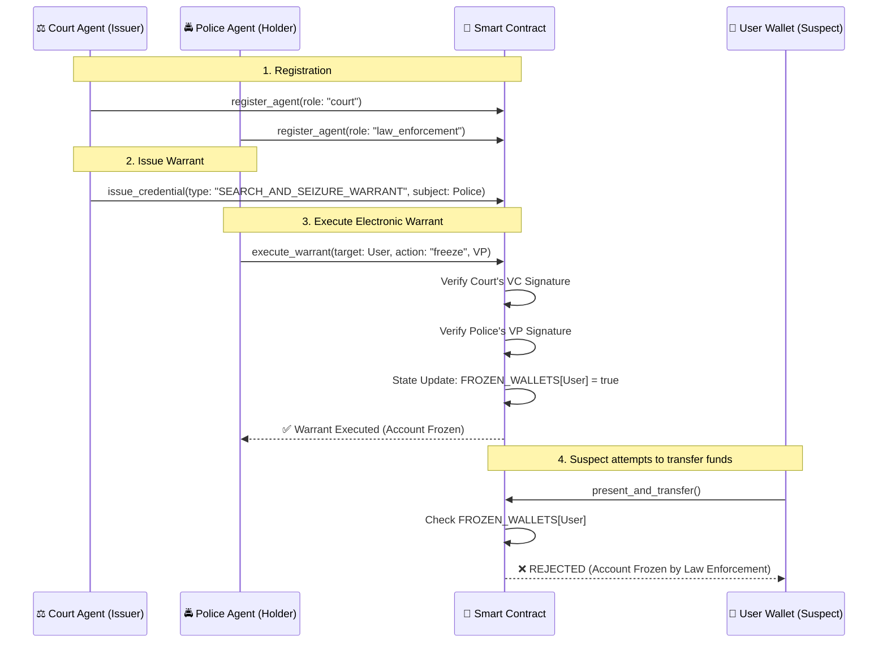

# 전자영장청구 DID 연동 구현 및 시뮬레이션 계획

금융사기(Fraud) 및 자금세탁(AML) 혐의 계정에 대해, 수사기관이 **블록체인 DID 및 전자영장(VC/VP) 기반으로 즉각적인 자금 동결 및 정보 요구**를 실행할 수 있는 아키텍처를 구현합니다. 

기존 레거시 뱅킹 시스템에서는 법원 영장 발부 -> 은행 송달 -> 은행 내부 컴플라이언스 팀 수동 확인 -> 계좌 동결까지 수일이 소요되나, 본 시스템에서는 **영장 자격 증명(VC)의 수학적 검증을 통해 1초 이내에 온체인에서 자금을 즉각 동결**합니다.

## 아키텍처 다이어그램

## Proposed Changes

### 1. Smart Contract 상태 및 메시지 확장

#### [MODIFY] [state.rs](file:///mnt/d/_Work/MC_and_nGNN_for_GoG/local_currency_dex/cosmwasm_adapter/src/state.rs)
- `FROZEN_WALLETS: Map<&str, bool>` 추가: 영장이 집행되어 동결된 지갑 DID를 추적.

#### [MODIFY] [msg.rs](file:///mnt/d/_Work/MC_and_nGNN_for_GoG/local_currency_dex/cosmwasm_adapter/src/msg.rs)
- `ExecuteMsg::ExecuteWarrant` 추가:
  - `law_enforcement_did`, `target_did`, `credential`(영장 VC), `nonce`, `vp_signature`, `action`("freeze_account") 파라미터 포함.
- `QueryMsg::GetWalletStatus` 추가: 특정 DID의 동결 여부 조회.

#### [MODIFY] [contract.rs](file:///mnt/d/_Work/MC_and_nGNN_for_GoG/local_currency_dex/cosmwasm_adapter/src/contract.rs)
- **`exec_execute_warrant` 로직 구현:** 
  1. 법원(Court)이 발급한 `WARRANT` 타입의 VC인지 검증.
  2. 수사기관(Police)의 VP 서명 검증.
  3. 검증 통과 시 `FROZEN_WALLETS` 상태 업데이트.
- **`exec_present_and_transfer` 로직 업데이트:** 
  - 송금 전 `FROZEN_WALLETS` 맵을 확인하여 동결된 계정일 경우 즉시 `DomainError("Account is frozen by law enforcement")` 반환.

### 2. 암호화 및 시뮬레이션 스크립트 작성

#### [MODIFY] [crypto_helper.py](file:///mnt/d/_Work/MC_and_nGNN_for_GoG/local_currency_dex/testnet_docker/crypto_helper.py)
- 법원(Court) 및 수사기관(Police) 용 ed25519 키쌍 생성 로직 추가.
- `WARRANT_CREDENTIAL` VC 및 이를 제출하기 위한 경찰의 VP 서명 로직 추가.

#### [NEW] [run_warrant_simulation.sh](file:///mnt/d/_Work/MC_and_nGNN_for_GoG/local_currency_dex/testnet_docker/run_warrant_simulation.sh)
전자영장 청구 자동화 데모 전용 쉘 스크립트.
- **시나리오 단계:**
  1. 혐의자(user1) 정상 결제 성공 확인.
  2. Court 및 Police Agent 등록.
  3. Court -> Police로 전자영장 VC 발급.
  4. Police -> 스마트 컨트랙트로 전자영장 집행 (`execute_warrant` -> 계좌 동결).
  5. 혐의자(user1) 결제 재시도 -> **동결로 인한 결제 거부(REJECTED) 확인.**

## Verification Plan

### Automated Tests
- `run_warrant_simulation.sh` 스크립트를 실행하여, 동일한 유저가 영장 집행 전에는 송금이 성공하고, 영장 집행 후에는 즉각적으로 실패함을 블록체인 트랜잭션 로그를 통해 증명합니다.

## User Review Required

> [!IMPORTANT]
> 본 구현을 완료한 후, 모든 산출물(Plan, Task, Walkthrough, 소스코드 변경 요약)을 요청하신 대로 `docs_stable_coin/work_reports/110_electronic_warrant_did_integration` 폴더에 일괄 복사 및 저장할 예정입니다. 설계안에 동의하신다면 승인 부탁드립니다.
