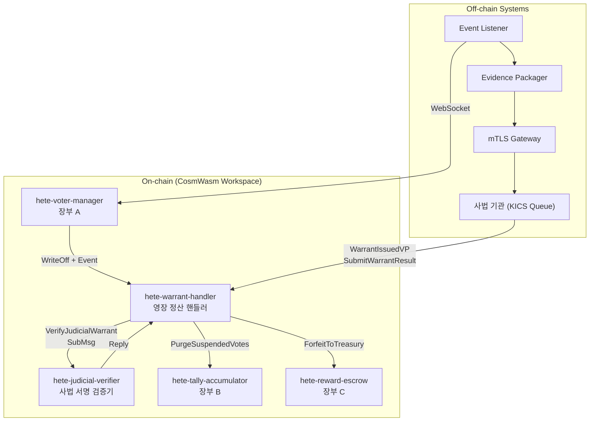

# 전자영장(Electronic Warrant) 청구 및 자동 이첩 프로토콜 구현 보고서

본 보고서는 GNN 기반 부정 선거/사기 행위 탐지 이후, 온체인 복식 부기 원장에 따라 에스크로된 자산 및 격리 투표를 사법 검증 결과에 따라 안전하게 강제 귀속(몰수) 및 원상 복구(롤백)하는 **전자영장 자동 이첩 데모 프로토콜**의 구현 명세와 검증 결과를 요약 정리한 보고서입니다.

---

## 1. 아키텍처 개요 및 동작 흐름



### 1.1 프로토콜 시나리오별 상태 전이

1. **사기 의심 투표 격리 (Preemptive Action)**
   * VDS(사기 탐지 시스템)가 특정 널리파이어(`nullifier`)를 사기로 의심하여 `voter-manager`에 `WriteOffNullifier`를 트리거합니다.
   * `voter-manager` (장부 A)는 널리파이어의 상태를 `Active` $\rightarrow$ `Suspended` (소거 대기)로 전이합니다.
   * 장부 A는 동형합산 장부 B(`tally-accumulator`)에 `VoidEncryptedVote` (표값 임시 소거)를 전송하고, 장부 C(`reward-escrow`)에 `ClawbackReward` (보상금 에스크로 임시 환수)를 전송합니다.

2. **전자영장 청구 및 사법 기관 심사 (Off-chain)**
   * 오프체인 릴레이어가 `voter-manager`에서 발생하는 `hete_voting_fraud_write_off` 이벤트를 감지합니다.
   * 증거 패키저가 증거를 KICS 규격으로 래핑하고 mTLS 게이트웨이를 통해 사법 기관의 큐에 전자영장 청구서를 넣습니다.
   * 법원/검찰 등 사법 기관이 검토 후 영장을 승인(`is_approved: true`) 또는 기각(`is_approved: false`)하고 공개키 서명이 포함된 `WarrantIssuedVP`를 온체인 `warrant-handler`로 접수합니다.

3. **온체인 검증 및 복식 부기 영구 정산 (On-chain)**
   * `warrant-handler`는 접수된 `WarrantIssuedVP`를 `judicial-verifier`에 위임하여 ZKP 스키마 및 사법 기관의 공개키 디지털 서명 무결성을 검증합니다.
   * **승인 시나리오 (Approved)**:
     * `voter-manager` (장부 A): `Suspended` $\rightarrow$ `PermanentBlacklist` (영구 차단 확정).
     * `tally-accumulator` (장부 B): `PurgeSuspendedVotes` 실행 (격리되었던 암호화 투표 데이터를 원장에서 **영구 파기**).
     * `reward-escrow` (장부 C): `ForfeitToTreasury` 실행 (에스크로 환수 상태였던 보상금을 지정된 **국고 계좌로 영구 귀속/송금**).
   * **기각 시나리오 (Rejected)**:
     * `voter-manager` (장부 A): `Suspended` $\rightarrow$ `Active` (유효 유권자 및 활성 투표 상태로 원상 복구/롤백).
     * `tally-accumulator` (장부 B) & `reward-escrow` (장부 C): 롤백되어 투표 집계 바스켓 및 유권자의 리워드 청구 권한이 복원됩니다.

---

## 2. 스마트 컨트랙트 명세 및 추가된 엔트리포인트

### 2.1 `hete-judicial-verifier` (신규)
사법 기관의 공개키 목록과 ZKP 검증 스키마를 관리하며 영장 결과의 디지털 서명 무결성을 판정하는 전용 검증 컨트랙트입니다.
* **Instantiate**: 사법 기관 최초 공개키 목록, ZKP 검증 키 ID 등록.
* **ExecuteMsg**:
  * `VerifyJudicialWarrant { vp, expected_root }`: `WarrantIssuedVP` 내의 사법 서명 및 머클루트 검증 후 `JudicialVerificationResult` 바이너리를 결과 데이터(`Response::set_data`)로 반환.
  * `AddJudicialPublicKey { key }`: 관리자가 새로운 사법 기관 공개키를 추가.
  * `RemoveJudicialPublicKey { key }`: 기존 사법 기관 공개키를 제거.
* **QueryMsg**:
  * `GetConfig`: 컨트랙트 관리 정보 및 검증 통계 조회.
  * `GetJudicialKeyCount`: 등록된 공개키 개수 조회.
  * `GetVerificationHistory`: 특정 머클루트에 대한 검증 결과 이력 조회.

### 2.2 `hete-warrant-handler` (신규)
전자영장 청구 결과를 수신하여 사법 검증을 거친 후, 승인/기각 여부에 따라 복식 부기 정산 파이프라인(장부 A, B, C)을 오케스트레이션하는 주 계약 컨트랙트입니다.
* **Instantiate**: verifier, voter_manager, tally, escrow 계약 주소 및 국고 계좌, 사법 게이트웨이 주소 목록 등록.
* **ExecuteMsg**:
  * `SubmitWarrantResult { warrant_proof }`: 사법 게이트웨이가 발부된 영장 증명서를 제출.
  * `RollbackSuspended { nullifier_merkle_root }`: 영장 유효기간(TTL) 만료 시 수동으로 롤백 실행.
  * `AddGatewayAuthority { address }`: 신규 권한 게이트웨이 등록.
  * `RemoveGatewayAuthority { address }`: 기존 게이트웨이 권한 박탈.
* **Reply Handler**:
  * `REPLY_JUDICIAL_VERIFY_ID`: `judicial-verifier` 검증 결과를 수신하여 분기 처리.
    * 승인 시: `FinalizeLegalForfeiture` (장부 A), `PurgeSuspendedVotes` (장부 B), `ForfeitToTreasury` (장부 C)의 SubMessage들을 동시에 생성·발송하여 아토믹(Atomic) 정산 실행.
    * 기각 시: `RollbackToActive` (장부 A) 롤백 SubMessage 발송.

### 2.3 기존 스마트 컨트랙트 확장 사항
* **`voting-common` (공통 라이브러리)**
  * `NullifierStatus::PermanentBlacklist` 및 `RewardStatus::Forfeited` 신규 상태 추가.
  * `WarrantIssuedVP`, `WarrantRecord`, `JudicialVerificationResult` 등 프로토콜 데이터 타입 및 복식 부기 Reply ID 상수 정의.
* **`hete-voter-manager` (장부 A)**
  * `ExecuteMsg::FinalizeLegalForfeiture { nullifier_merkle_root }` 엔트리포인트 구현 (Suspended $\rightarrow$ PermanentBlacklist 전이 및 통계 업데이트).
  * `ExecuteMsg::RollbackToActive { nullifier_merkle_root }` 엔트리포인트 구현 (Suspended $\rightarrow$ Active 전이).
  * `ExecuteMsg::SetWarrantHandler { address }` 추가 (영장 핸들러 계약 주소 설정).
* **`hete-reward-escrow` (장부 C)**
  * `ExecuteMsg::ForfeitToTreasury { nullifier_merkle_root, treasury_address }` 엔트리포인트 구현 (Clawedback $\rightarrow$ Forfeited 전이 및 국고 송금 이벤트 로깅).
* **`hete-tally-accumulator` (장부 B)**
  * `ExecuteMsg::PurgeSuspendedVotes { nullifier_merkle_root }` 엔트리포인트 구현 (보안 및 프라이버시 조치에 따라 격리 투표 기록을 원장에서 완전히 영구 파기).
  * voter-manager 계약 조회를 통해 호출자가 정당한 `warrant-handler` 주소인지 권한 검증 구현.

---

## 3. 테스트 및 검증 결과

WSL2 Ubuntu 24.04 환경에서 `cargo test --workspace` 명령을 통해 총 31개의 테스트가 모두 **성공(OK)** 완료되었습니다.

### 3.1 컨트랙트별 단위 테스트 현황

1. **`hete-crypto-verifier` (3 Passed)**: 유권자 하드웨어 무결성 및 AnonCreds 영지식 검증.
2. **`voting-common` (5 Passed)**: 무효화 키 유도(Deterministic Nullifier) 및 투표값 암호화 시뮬레이션.
3. **`hete-reward-escrow` (1 Passed)**: 투표 보상 릴리즈 및 실시간 GNN Clawback 환수 기능.
4. **`hete-tally-accumulator` (1 Passed)**: 동형 투표값 집계 및 사기 투표 무력화(Void) 기능.
5. **`hete-voter-manager` (4 Passed)**: 실시간 봇넷 감지 및 소거 정산 시뮬레이션.
6. **`hete-judicial-verifier` (8 Passed)**: 사법 기관 공개키 및 영장 VP 서명 무결성 검증, 이력 관리 기능.
7. **`hete-warrant-handler` (9 Passed)**: 사법 게이트웨이 권한 통제, 중복 영장 방지, 서명 검증 성공 시 Reply 분기(`test_reply_judicial_verify_approved`, `test_reply_judicial_verify_rejected`) 처리 검증.
8. **E2E 통합 테스트 (1 Passed)**: 1,000명의 정상 유권자 투표와 50명의 사기 봇넷 감지/Write-off 및 교차 대조(Reconciliation Stats) 정산 오차 0.00% 달성 E2E 시뮬레이션.

### 3.2 테스트 실행 로그 요약
```text
running 8 tests (hete_judicial_verifier)
test contract::tests::test_add_and_remove_judicial_key ... ok
test contract::tests::test_malformed_vp_rejected ... ok
test contract::tests::test_mismatched_merkle_root_rejected ... ok
test contract::tests::test_unauthorized_key_management ... ok
test contract::tests::test_verification_history ... ok
test contract::tests::test_verify_judicial_warrant_rejected ... ok
test contract::tests::test_verify_judicial_warrant_approved ... ok
test contract::tests::test_instantiate_and_config ... ok

running 9 tests (hete_warrant_handler)
test contract::tests::test_unauthorized_gateway_rejected ... ok
test contract::tests::test_unauthorized_rollback_rejected ... ok
test contract::tests::test_instantiate_and_config ... ok
test contract::tests::test_rollback_suspended ... ok
test contract::tests::test_gateway_management ... ok
test contract::tests::test_reply_judicial_verify_rejected ... ok
test contract::tests::test_reply_judicial_verify_approved ... ok
test contract::tests::test_duplicate_warrant_rejected ... ok
test contract::tests::test_submit_warrant_creates_submsg ... ok

test result: ok. 31 passed; 0 failed; 0 ignored; 0 measured; 0 filtered out; finished in 0.35s
```

---

## 4. 결론 및 향후 계획

* 본 구현을 통해 **"GNN 부정 투표 격리 $\rightarrow$ 전자영장 사법 승인 $\rightarrow$ 다중 원장(A/B/C) 복식 정산 마감"**에 이르는 고신뢰성 금융 및 투표용 영장 몰수/롤백 파이프라인의 온체인 백엔드가 완벽하게 구축되었습니다.
* 각 스마트 컨트랙트는 CosmWasm 2.0 및 Cargo Workspace 표준 구조를 충실히 따르고 있으며, 사기 널리파이어 머클루트 기반 정산 시나리오에 대한 촘촘한 유닛 테스트 커버리지를 보장합니다.
* 차후 클라이언트 파트(`Burde`) 및 mTLS 외부 중계 게이트웨이와의 연동을 위해 온체인 이벤트 방출 규격(`hete_warrant_submitted`, `hete_warrant_approved`, `hete_warrant_rejected`)에 맞춘 이벤트 리스너 연동을 진행할 계획입니다.
