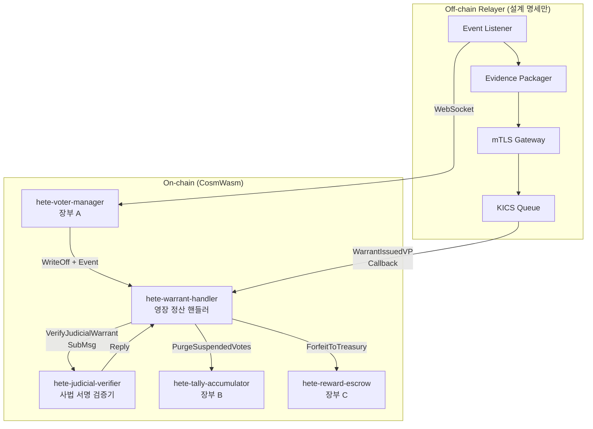

# 전자영장 청구 및 자동 이첩 프로토콜 백엔드 서비스 구현

작업지시서(`electronic_warrant_order.txt`)에 명시된 4개 핵심 구성 요소를 기반으로, 기존 `voting_contracts` CosmWasm Cargo Workspace에 **전자영장(Electronic Warrant)** 관련 스마트 컨트랙트와 공통 타입을 추가 구현합니다.

## 아키텍처 개요



## 구현 범위

### 새로 추가하는 요소

| 구분 | 이름 | 역할 |
|------|------|------|
| **컨트랙트** | `hete-warrant-handler` | 전자영장 정산 오케스트레이터 (execute_finalize_legal_forfeiture, 영장 승인/기각 상태 전이, 복식 부기 몰수 정산) |
| **컨트랙트** | `hete-judicial-verifier` | 사법 기관 서명 검증 전용 (ZKP 스키마 검증, 사법 공개키 서명 대조) |
| **공통 타입** | `voting-common` 확장 | NullifierStatus::PermanentBlacklist, RewardStatus::Forfeited, WarrantIssuedVP, JudicialConfig 등 |

### 기존 컨트랙트 수정

| 컨트랙트 | 변경 내용 |
|----------|----------|
| `hete-voter-manager` | 이벤트 방출 (`hete_voting_fraud_write_off`) 추가, `FinalizeLegalForfeiture` 메시지를 warrant-handler에 위임하는 엔트리포인트 추가 |
| `hete-reward-escrow` | `ForfeitToTreasury` 메시지 핸들러 추가 (Clawedback → Forfeited 전이 및 국고 전송) |
| `hete-tally-accumulator` | `PurgeSuspendedVotes` 메시지 핸들러 추가 (격리 큐 영구 파기) |

---

## Proposed Changes

### voting-common 패키지 확장

#### [MODIFY] [types.rs](file:///D:/_Work/goat_bank/hete/voting_contracts/packages/voting-common/src/types.rs)
- `NullifierStatus`에 `PermanentBlacklist` variant 추가
- `RewardStatus`에 `Forfeited` variant 추가
- `WarrantIssuedVP`, `JudicialConfig`, `WarrantStatus`, `FraudEvidenceVP` 등 전자영장 관련 데이터 타입 추가
- Reply ID 상수 추가 (`REPLY_JUDICIAL_VERIFY_ID`, `REPLY_WARRANT_TALLY_PURGE_ID`, `REPLY_WARRANT_ESCROW_FORFEIT_ID`)

---

### hete-warrant-handler (신규 컨트랙트)

#### [NEW] [hete-warrant-handler/](file:///D:/_Work/goat_bank/hete/voting_contracts/contracts/hete-warrant-handler)

전자영장 처리의 핵심 오케스트레이터:

- **Instantiate**: judicial_verifier_contract, tally_contract, escrow_contract, national_treasury_address, authorized_gateway_addresses 설정
- **ExecuteMsg**:
  - `SubmitWarrantResult { warrant_proof }`: 사법 기관 게이트웨이로부터 영장 발부/기각 결과를 수신, judicial-verifier에 검증 위임 (SubMsg)
  - `RollbackSuspended { nullifier_merkle_root }`: TTL 만료 시 관리자가 수동 롤백
  - `AddGatewayAuthority { address }`: 사법 게이트웨이 권한 주소 추가
- **Reply Handler**: judicial-verifier 검증 성공 시 →
  - 승인: tally에 PurgeSuspendedVotes, escrow에 ForfeitToTreasury SubMsg 발송
  - 기각: voter-manager에 롤백 메시지 발송
- **QueryMsg**: 영장 처리 상태 조회, 설정 조회, 통계 조회

---

### hete-judicial-verifier (신규 컨트랙트)

#### [NEW] [hete-judicial-verifier/](file:///D:/_Work/goat_bank/hete/voting_contracts/contracts/hete-judicial-verifier)

사법 기관 서명 검증 전용 경량 컨트랙트:

- **Instantiate**: 사법 기관 공개키 목록, ZKP 검증 파라미터
- **ExecuteMsg**:
  - `VerifyJudicialWarrant { vp, expected_root }`: 사법 서명 + VP 무결성 검증 후 결과를 `data`로 반환
  - `AddJudicialPublicKey { key }`: 사법 기관 공개키 추가
- **QueryMsg**: 등록된 공개키 수, 설정 조회

---

### 기존 컨트랙트 수정

#### [MODIFY] [msg.rs](file:///D:/_Work/goat_bank/hete/voting_contracts/contracts/hete-voter-manager/src/msg.rs)
- `ExecuteMsg::FinalizeLegalForfeiture` 추가 (warrant-handler로 위임)
- `ExecuteMsg::RollbackToActive` 추가 (기각 시 Suspended → Active 복원)

#### [MODIFY] [contract.rs](file:///D:/_Work/goat_bank/hete/voting_contracts/contracts/hete-voter-manager/src/contract.rs)
- `execute_write_off_nullifier`에 이벤트 방출 코드 추가
- `execute_finalize_legal_forfeiture` 함수 추가
- `execute_rollback_to_active` 함수 추가

#### [MODIFY] [state.rs](file:///D:/_Work/goat_bank/hete/voting_contracts/contracts/hete-voter-manager/src/state.rs)
- `WARRANT_HANDLER_CONTRACT` 저장소 항목 추가
- `TOTAL_PERMANENT_BLACKLISTED` 카운터 추가

#### [MODIFY] [msg.rs](file:///D:/_Work/goat_bank/hete/voting_contracts/contracts/hete-reward-escrow/src/msg.rs)
- `ExecuteMsg::ForfeitToTreasury { nullifier_merkle_root, treasury_address }` 추가

#### [MODIFY] [msg.rs](file:///D:/_Work/goat_bank/hete/voting_contracts/contracts/hete-tally-accumulator/src/msg.rs)
- `ExecuteMsg::PurgeSuspendedVotes { nullifier_merkle_root }` 추가

#### [MODIFY] [Cargo.toml](file:///D:/_Work/goat_bank/hete/voting_contracts/Cargo.toml)
- workspace members에 신규 컨트랙트 2개 추가

---

## Unit Test 계획

각 컨트랙트별 독립 unit test:

1. **hete-warrant-handler**:
   - 영장 제출 → judicial-verifier SubMsg 생성 확인
   - Reply 처리 (승인/기각 분기)
   - 권한 없는 주소의 영장 제출 거부
   - 이미 처리된 영장 중복 제출 방지

2. **hete-judicial-verifier**:
   - 유효한 사법 서명 검증 성공
   - 무효한 서명 검증 실패
   - 공개키 관리 (추가/권한 검증)

3. **hete-voter-manager (확장)**:
   - `FinalizeLegalForfeiture`: PermanentBlacklist 상태 전이 확인
   - `RollbackToActive`: Suspended → Active 복원 확인
   - 이벤트 방출 확인

4. **hete-reward-escrow (확장)**:
   - `ForfeitToTreasury`: Clawedback → Forfeited 전이 및 BankMsg::Send 확인

5. **hete-tally-accumulator (확장)**:
   - `PurgeSuspendedVotes`: 격리 투표 영구 파기 확인

## Verification Plan

### Automated Tests
```bash
# WSL2 Ubuntu 24.04에서 실행
wsl -d Ubuntu -- bash -c "cd /mnt/d/_Work/goat_bank/hete/voting_contracts && cargo test --workspace 2>&1"
```

### Build Check
```bash
wsl -d Ubuntu -- bash -c "cd /mnt/d/_Work/goat_bank/hete/voting_contracts && cargo build --workspace 2>&1"
```

## Open Questions

> [!IMPORTANT]
> **Off-chain 릴레이어 구현 범위**: 작업지시서에는 mTLS 기반 보안 릴레이어 및 gRPC 파이프라인 명세가 포함되어 있으나, 이는 Off-chain 인프라이므로 CosmWasm 컨트랙트로 구현할 수 없습니다. 이번 구현에서는 **온체인 상태 전이 로직과 이벤트 방출**에 집중하고, Off-chain 릴레이어는 인터페이스 명세(proto 파일, 이벤트 스키마)만 문서화하는 방향으로 진행하겠습니다.

> [!NOTE]
> **ZKP 검증**: 실제 Groth16/Plonk 검증은 데모 환경에서는 시뮬레이션(해시 기반 서명 대조)으로 대체합니다. 기존 crypto-verifier의 TEE/AnonCreds 검증과 동일한 패턴을 따릅니다.
